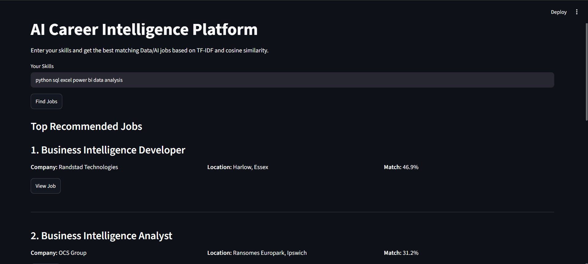

# AI Career Intelligence Platform

An end-to-end Data & AI job market intelligence platform that collects job postings from multiple sources, stores and processes them in PostgreSQL, extracts technical skills, analyzes market demand, and recommends relevant jobs based on a user's skills.

The project combines **Data Engineering, Data Analysis, Machine Learning, Power BI, PostgreSQL, and Streamlit** in one complete pipeline.

---

##  Project Overview

Finding relevant Data and AI opportunities can be difficult because job postings are distributed across different platforms and often contain inconsistent information.

The **AI Career Intelligence Platform** was built to create a centralized pipeline that can:

- Collect job postings from multiple job platforms.
- Store structured job data in PostgreSQL.
- Identify Data & AI related opportunities.
- Extract technical skills from job descriptions.
- Analyze market demand for roles, companies, locations, and skills.
- Recommend jobs based on a user's skills.
- Present insights through an interactive Power BI dashboard.
- Provide a simple Streamlit interface for job recommendations.

The goal is not only to collect jobs, but to transform raw job postings into useful career intelligence.

---

##  Key Features

### Job Data Collection
Collects job postings from multiple external sources:

- Adzuna
- Arbeitnow
- Jobicy
- Remotive

The ingestion pipeline standardizes jobs before storing them in PostgreSQL.

### Data & AI Job Classification
Jobs are classified to distinguish Data/AI opportunities from unrelated roles.

Supported role categories include:

- Data Analyst
- Data Scientist
- Data Engineer
- Business Intelligence
- Machine Learning Engineer
- AI Engineer

### Skill Extraction
Technical skills are extracted from job descriptions and normalized into a structured skills model.

Examples include:

- Python
- SQL
- Excel
- Power BI
- Machine Learning
- Data Analysis
- Data Engineering
- AWS
- Azure
- Google Cloud
- Docker
- Airflow
- PostgreSQL
- NLP

### ML-Based Job Recommendation
The recommendation engine compares a user's skills with available Data/AI jobs using:

- **TF-IDF vectorization**
- **Cosine similarity**

Jobs are ranked according to their similarity with the user's skill profile.

### Interactive Analytics
A Power BI dashboard provides an overview of:

- Total collected jobs
- Data/AI jobs
- Data/AI share
- Most demanded Data/AI roles
- Most requested technical skills
- Companies hiring Data/AI talent
- Top locations in the collected dataset

---

##  System Architecture

```text
External Job APIs
       │
       ▼
Job Scrapers
       │
       ▼
Data Ingestion & Standardization
       │
       ▼
PostgreSQL Database
       │
       ├──────────────► Skill Extraction
       │
       ├──────────────► Data/AI Classification
       │
       ├──────────────► Market Analytics
       │
       │
       ├──────────────► ML Job Recommendation
       │                    │
       │                    ▼
       │                Streamlit App
       │
       ▼
Power BI Dashboard
```

This architecture separates data collection, storage, processing, analytics, recommendation, and presentation into independent layers.

---

##  Power BI Dashboard

The Power BI dashboard connects directly to PostgreSQL and provides an interactive overview of the collected Data & AI job market.


### Current Dataset Snapshot

At the time of the dashboard snapshot:

- **390 total jobs collected**
- **129 Data/AI jobs identified**
- **33.1% of collected jobs classified as Data/AI**

The dashboard includes interactive filters for:

- Role
- Company
- Source

### Dashboard Insights

The collected dataset shows strong demand across several Data & AI career paths, including AI Engineering, Data Analysis, Machine Learning Engineering, Business Intelligence, Data Engineering, and Data Science.

Machine Learning appears as the most frequently identified skill among Data/AI opportunities in the current dataset.

> **Note:** The dashboard represents the collected job dataset and should not be interpreted as a complete representation of the global job market. Location values may also contain variations such as `London` and `London, UK`.

---

##  Job Recommendation System

The project includes a simple ML-based recommendation engine that ranks jobs according to a user's skills.

Users enter skills such as:

```text
python sql excel power bi data analysis
```

The system creates a text representation of each job and compares the user's profile with job postings.

### Recommendation Pipeline

```text
User Skills
    │
    ▼
Text Preprocessing
    │
    ▼
TF-IDF Vectorization
    │
    ▼
Cosine Similarity
    │
    ▼
Job Ranking
    │
    ▼
Top Recommended Jobs
```

### Streamlit Interface



The interface displays:

- Job title
- Company
- Location
- Match percentage
- Link to the original job posting

---

##  Machine Learning Approach

The MVP uses a **content-based recommendation approach**.

### TF-IDF

TF-IDF converts job text and the user's skills into numerical vectors.

It gives more importance to terms that are useful for distinguishing one job from another.

### Cosine Similarity

Cosine similarity measures how similar the user's skill vector is to each job vector.

Conceptually:

```text
User Skills
    ↓
TF-IDF Vector

Job Description + Skills + Role
    ↓
TF-IDF Vector

        ↓

Cosine Similarity

        ↓

Match Score
```

Jobs with higher similarity scores are ranked higher.

This provides an interpretable baseline recommendation model without requiring historical user interaction data.

---

##  Database Design

The PostgreSQL database currently uses three core tables:

### `jobs`

Stores job information such as:

- Title
- Company
- Location
- Employment type
- Experience level
- Salary information
- Description
- Source
- Source URL
- Posting date
- Data/AI classification
- Data/AI role

### `skills`

Stores normalized technical skills.

### `job_skills`

Bridge table connecting jobs with their extracted skills.

Relationship:

```text
jobs
  1
  │
  *
job_skills
  *
  │
  1
skills
```

This structure allows one job to contain multiple skills while the same skill can appear across many jobs.

---

##  Tech Stack

### Programming & Data Processing

- Python
- Pandas
- Requests

### Database

- PostgreSQL
- SQLAlchemy
- Psycopg

### Machine Learning

- Scikit-learn
- TF-IDF
- Cosine Similarity

### Analytics & Visualization

- Power BI
- DAX

### Application

- Streamlit

### Testing & Development

- Pytest
- Git
- GitHub
- VS Code

---

##  Project Structure

```text
ai-career/
│
├── Dashboard/
│   └── AI_Career_Intelligence_Dashboard.pbix
│
├── screenshots/
│   ├── dashboard_overview.png
│   └── job_recommender.png
│
├── src/
│   ├── analytics/
│   ├── career/
│   ├── config/
│   ├── database/
│   │   ├── models/
│   │   └── repositories/
│   ├── processing/
│   ├── scraper/
│   │   └── sources/
│   ├── utils/
│   └── app.py
│
├── tests/
│
├── requirements.txt
├── .gitignore
└── README.md
```

---

##  Installation

### 1. Clone the Repository

```bash
git clone <repository-url>
cd ai-career
```

### 2. Create a Virtual Environment

Windows:

```bash
python -m venv venv
venv\Scripts\activate
```

### 3. Install Dependencies

```bash
pip install -r requirements.txt
```

---

##  Environment Configuration

Create a `.env` file for local database/API configuration.

Example:

```env
DB_HOST=localhost
DB_PORT=5432
DB_NAME=ai_career
DB_USERNAME=your_username
DB_PASSWORD=your_password

ADZUNA_APP_ID=your_app_id
ADZUNA_APP_KEY=your_app_key
```

Do not commit the `.env` file or API credentials to GitHub.

---

##  PostgreSQL Setup

Create a PostgreSQL database:

```text
ai_career
```

The application uses SQLAlchemy models for the database layer.

The core database entities are:

```text
jobs
skills
job_skills
```

---

##  Running the Recommendation App

From the project root:

```powershell
$env:PYTHONPATH = "."
python -m streamlit run src/app.py
```

Then open the local Streamlit application in your browser and enter your skills to receive job recommendations.

---

##  Testing

The project uses `pytest` for automated testing.

Run the test suite with:

```bash
pytest -v
```

Tests cover important components including:

- Skill extraction
- Job relevance classification
- Data/AI role classification
- Feature building
- Job recommendation logic
- External job source integration

---

##  Example Market Analysis

The platform can answer questions such as:

- Which Data/AI roles appear most frequently?
- Which technical skills are most requested?
- Which companies are hiring Data/AI professionals?
- Which locations contain the most opportunities in the collected data?
- What percentage of collected jobs are Data/AI related?
- Which jobs best match a candidate's current skills?

This transforms the project from a simple job scraper into a small **career intelligence system**.

---

##  Future Improvements

Potential improvements include:

- Location normalization
- More job data sources
- Scheduled automated scraping
- Improved skill extraction using NLP
- Semantic job matching using embeddings
- User profiles and saved preferences
- Experience-level filtering
- Salary analytics
- Recommendation explanations and skill-gap analysis
- Historical job-market trend analysis
- Cloud deployment
- Automated Power BI data refresh

---

##  Project Purpose

This project was developed as a portfolio project to demonstrate practical skills across:

**Data Engineering → Database Design → Data Processing → Analytics → Machine Learning → BI → Application Development**

Rather than building isolated notebooks, the project focuses on connecting these components into a working end-to-end system.

---

##  Author

**Mohammad Ali Othman**

Data Science Graduate  
Interested in Data Analytics, Business Intelligence, Machine Learning, and Data Engineering.